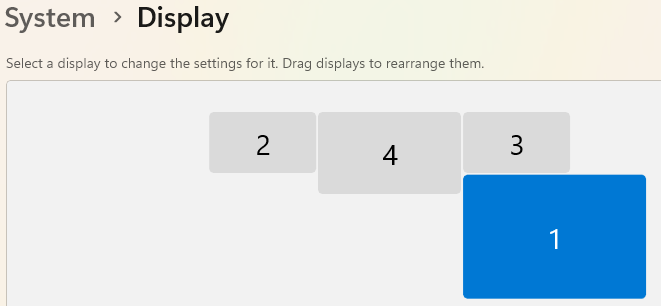

I made a bouncing-ball screensaver that follows the real shape of a messy multi-monitor setup like mine:



Most screensavers either treat the whole desktop as one big rectangle or run a separate copy on each screen. Bounce treats your monitor layout as one connected space. The ball (or several balls, or a logo) moves freely from one screen to the next and bounces off the edges where monitors of different sizes don't line up, including the inside corners those mismatched edges create.

- Source Code: [on github](https://github.com/aarace/bounce)

## Features

- Uses your real arrangement from Settings → System → Display (monitors must be set to **Extend**)
- Multiple balls, or a custom image in place of the ball
- Adjustable color, size, and speed
- Optional flash when a ball hits a corner dead-on
- Optional fading trail, or a "Forever" trail that never fades. Leave the Forever trail running for a while and it should eventually paint over every screen, which makes it a handy way to check that the ball can reach every part of your layout.
- Works with mixed-DPI monitors
- Can be installed without admin rights

## How it works

### The play area is the union of your monitors

`MonitorRegion` builds a GDI+ `Region` from the union of every `Screen.Bounds`. That gives the exact shape of your desktop, notches and all.

Monitors that look snapped together in Display Settings can still have a small gap between their actual pixel bounds. That happens with mixed DPI, or just from imprecise dragging. Without a fix, the ball would treat that gap as a solid wall. So any two monitors that face each other across a small gap get a "bridge" rectangle filling it:

```csharp
// a's right edge facing b's left edge.
int horizontalGap = b.Left - a.Right;
if (horizontalGap > 0 && horizontalGap <= MaxBridgeableGap)
{
    int top = Math.Max(a.Top, b.Top);
    int bottom = Math.Min(a.Bottom, b.Bottom);
    if (bottom > top)
        bridges.Add(Rectangle.FromLTRB(a.Right, top, b.Left, bottom));
}
```

Containment checks run every tick, so they're kept cheap. Most of the time the ball is fully inside a single monitor, and plain rectangle math answers the question. The slower GDI+ region test only runs when the ball is straddling a seam.

### Collision tests each axis on its own

Each tick, the ball tests three possible moves: X only, Y only, and both together. Comparing the results tells it what kind of edge it ran into:

```csharp
bool xOk    = _region.Contains(new RectangleF(nx, Position.Y, Size, Size));
bool yOk    = _region.Contains(new RectangleF(Position.X, ny, Size, Size));
bool bothOk = _region.Contains(new RectangleF(nx, ny, Size, Size));
```

- **Both OK:** move diagonally as normal.
- **Only one axis OK:** it hit a flat edge, so slide along it and reverse the other direction.
- **Each axis OK alone, but not together:** this is the interesting case. The diagonal move would cut across the notch where two monitors of different sizes meet, through space that isn't on any screen. The ball slides along whichever axis it's moving faster on and bounces off the other.
- **Neither OK:** a dead-on corner hit. Both directions reverse (and the corner flash fires, if it's turned on).

### One window per monitor

Windows applies a single DPI scale to each top-level window. With one giant window stretched across monitors that have different DPI settings, Windows stretches the parts that aren't on the window's "home" monitor, which made the ball look squashed. So Bounce opens one borderless, topmost window per monitor. A single shared simulation drives all of them, and each window draws its own part of the desktop at native resolution.

## Installing

Every build also produces a `Bounce.scr`. Right-click it and choose **Install**. Or, if you don't have admin rights, run `Install-Screensaver.ps1` from the repo. It points the per-user registry setting at the build output instead of copying anything into System32. The repo README also covers publishing a self-contained build for machines without the .NET 10 runtime.
